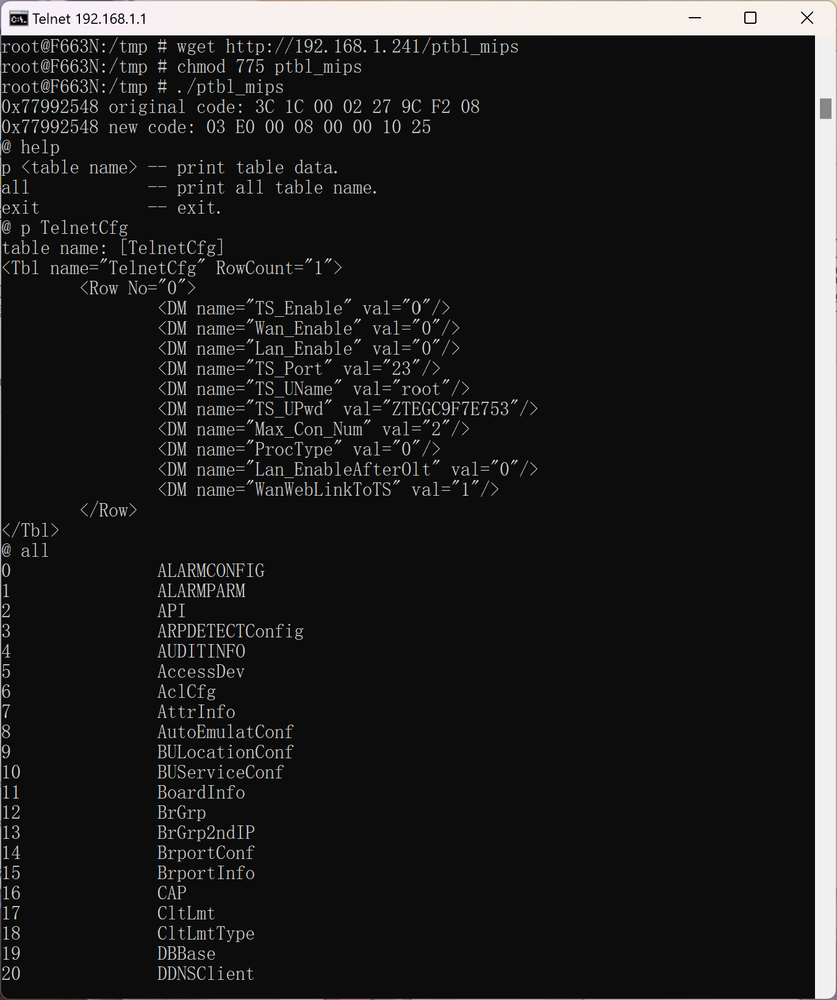
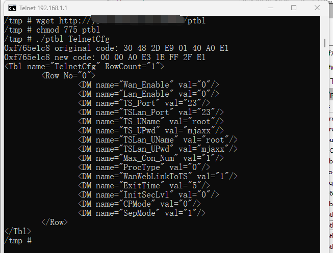

# zte printbl
Similar to ZTE optical modem's "sendcmd 1 DB p &lt;table name>" and "sendcmd 1 DB all" commands

<pre><code>
Usage: ptbl &lt;table name&gt;
</code></pre>

### F663N(uClibc 0.9.32, mips)

### arm(soft float)
